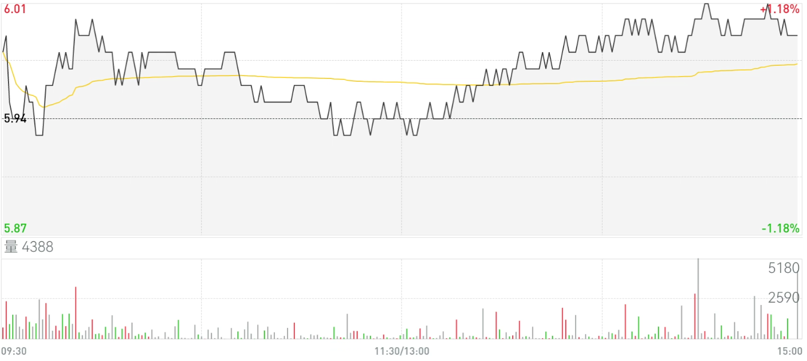

# 一、求测内容

| 项目     | 内容                                                |
| :------- | :-------------------------------------------------- |
| 年龄     | 34                                                  |
| 职业     | IT                                                  |
| 性别     | 男                                                  |
| 策项     | 杂占                                                |
| 钥语     | 我买的华西股份000936在2023年2月20日价格走势情况如何 |
| 条件     |                                                     |
| 时限     |                                                     |
| 起卦时间 | 2023年02月17日09点                                  |
| 事件时间 |                                                     |
| 起卦方式 | 文字笔画起卦                                        |
| 卦码     | 152卦                                               |

# 二、卦

|                | 癸卯年甲寅月     | 丙午日           | 寅卯空         |
| :------------- | :--------------- | :--------------- | :------------- |
| **伏神** | **天风姤** | **天山遁** | **六神** |
|                | 父戌、           | 戌、             | 龙             |
|                | 兄申、           | 申、             | 玄             |
|                | 官午、应         | 午、             | 虎             |
|                | 兄酉、           | 申、             | 蛇             |
| 财寅           | 孙亥○           | 午..             | 勾             |
|                | 父丑..乾         | 辰..             | 雀             |

# 三、断语

20日，降。酉日，亥水旺。

实际上是涨了1.18%

官爻旺，孙爻是情绪。官爻入钱做情绪。

# 四、实际情况

| 月 | 日 | 时 | 分 | 预测 | 实际                   | 原因 |
| -- | -- | -- | -- | ---- | ---------------------- | ---- |
| 寅 | 酉 | 巳 | 卯 | 涨   | 骤降，最低点，然后涨   |      |
|    |    |    | 辰 |      | 急涨                   |      |
|    |    |    | 巳 |      | 涨                     |      |
|    |    |    | 午 |      | 降                     |      |
|    |    |    | 未 |      | 涨                     |      |
|    |    |    | 申 |      | 降                     |      |
|    |    |    | 酉 |      | 涨                     |      |
|    |    |    | 戌 |      | 降                     |      |
|    |    |    | 亥 |      | 涨                     |      |
|    |    | 午 | 子 |      | 降                     |      |
|    |    |    | 丑 |      | 涨，最低点             |      |
|    |    |    | 寅 |      | 涨，最低点             |      |
|    |    | 未 | 子 |      | 先降后涨，最低点，持平 |      |
|    |    |    | 丑 |      | 涨                     |      |
|    |    |    | 寅 |      | 涨                     |      |
|    |    |    | 卯 |      | 涨                     |      |
|    |    |    | 辰 |      | 涨                     |      |
|    |    |    | 巳 |      | 涨                     |      |
|    |    |    | 午 |      | 涨                     |      |
|    |    |    | 未 |      | 先涨后跌，持平         |      |
|    |    |    | 申 |      | 涨                     |      |
|    |    |    | 酉 |      | 跌，最高点             |      |
|    |    |    | 戌 |      | 涨                     |      |
|    |    |    | 亥 |      | 跌，先达到最高点，后跌 |      |
