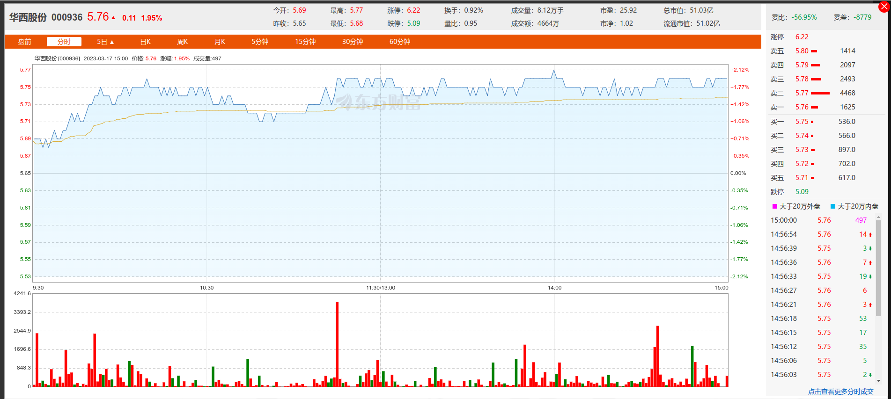
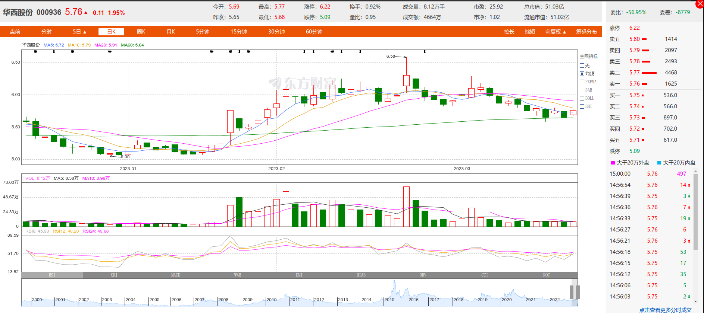

# 一、求测内容

| 项目     | 内容                                                 |
| :------- | :--------------------------------------------------- |
| 年龄     | 34                                                   |
| 职业     | IT                                                   |
| 性别     | 男                                                   |
| 策项     | 杂占                                                 |
| 钥语     | 华西股份2023年3月13日至3月17日每日的股票价格涨跌如何 |
| 条件     |                                                      |
| 时限     |                                                      |
| 起卦时间 | 2023年03月13日08点                                   |
| 事件时间 |                                                      |
| 起卦方式 | 文字笔画起卦                                         |
| 卦码     | 445卦                                                |

# 二、卦

|                | 癸卯年乙卯月     | 庚午日           | 戌亥空         |
| :------------- | :--------------- | :--------------- | :------------- |
| **伏神** | **震为雷** | **泽雷随** | **六神** |
|                | 财戌..震         | 未..             | 蛇             |
|                | 官申×           | 酉、             | 勾             |
|                | 孙午、           | 亥、             | 雀             |
|                | 财辰..应         | 辰..             | 龙             |
|                | 兄寅..           | 寅..             | 玄             |
|                | 父子、           | 子、             | 虎             |

# 三、断语

大跌。

13午，午火克了官爻，涨。实际情况是先涨后跌，然后再涨。

14未，降，对

15申，降，错了。当天，兄弟爻暗动。可能是关键。

16酉，降，对

17戌，降，错，实际上是涨。申酉戌三会金。会到了财上。

# 四、实际情况

17日

最后5个k线，是

