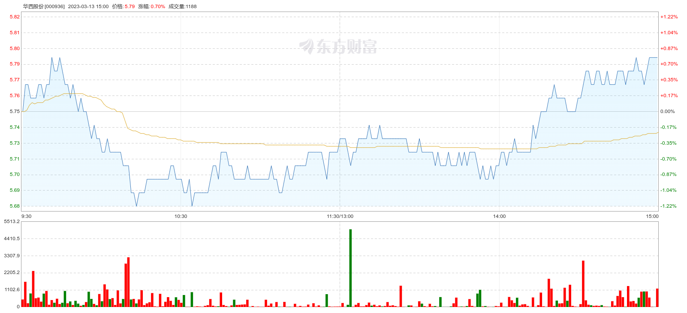

# 一、求测内容

| 项目     | 内容                                                            |
| :------- | :-------------------------------------------------------------- |
| 年龄     | 34                                                              |
| 职业     | IT                                                              |
| 性别     | 男                                                              |
| 策项     | 杂占                                                            |
| 钥语     | 华西股份2023年3月13日的股票收盘价与上一交易日的收盘价比涨跌如何 |
| 条件     |                                                                 |
| 时限     |                                                                 |
| 起卦时间 | 2023年03月13日08点                                              |
| 事件时间 |                                                                 |
| 起卦方式 | 文字笔画起卦                                                    |
| 卦码     | 166卦                                                           |

# 二、卦

|                | 癸卯年乙卯月     | 庚午日           | 戌亥空         |
| :------------- | :--------------- | :--------------- | :------------- |
| **伏神** | **天水讼** | **泽水困** | **六神** |
|                | 孙戌○           | 未..             | 蛇             |
|                | 财申、           | 酉、             | 勾             |
|                | 兄午、离         | 亥、             | 雀             |
| 官亥           | 兄午..           | 午..             | 龙             |
|                | 孙辰、           | 辰、             | 玄             |
|                | 父寅..应         | 寅..             | 虎             |

# 三、断语

涨。

孙爻化退，但是午日兄弟爻当旺。

# 四、实际情况

涨了0.75%

最开始的时候跌的厉害，下午未时涨上去了。

