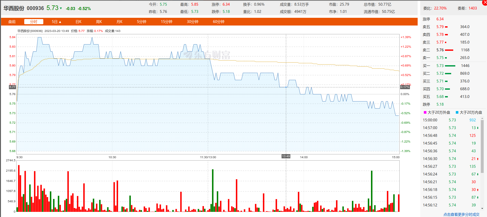
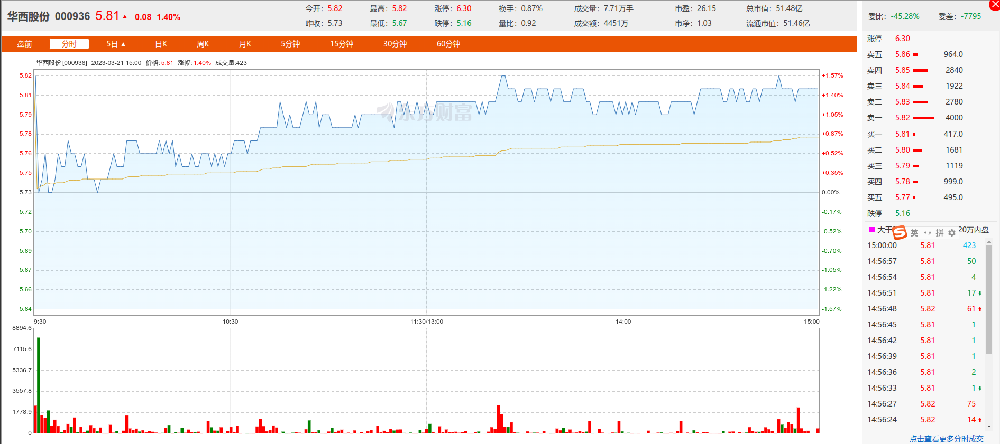

# 一、求测内容

| 项目     | 内容                                            |
| :------- | :---------------------------------------------- |
| 年龄     | 34                                              |
| 职业     | IT                                              |
| 性别     | 男                                              |
| 策项     | 杂占                                            |
| 钥语     | 华西股份2023年3月20日至24日分日价格涨跌情况如何 |
| 条件     |                                                 |
| 时限     |                                                 |
| 起卦时间 | 2023年03月20日16点                              |
| 事件时间 |                                                 |
| 起卦方式 | 文字笔画起卦                                    |
| 卦码     | 454卦                                           |

# 二、卦

|                | 癸卯年乙卯月     | 丁丑日           | 申酉空         |
| :------------- | :--------------- | :--------------- | :------------- |
| **伏神** | **雷风恒** | **地风升** | **六神** |
|                | 财戌..应         | 酉..             | 龙             |
|                | 官申..           | 亥..             | 玄             |
|                | 孙午○           | 丑..             | 虎             |
|                | 官酉、震         | 酉、             | 蛇             |
| 兄寅           | 父亥、           | 亥、             | 勾             |
|                | 财丑..           | 丑..             | 雀             |

# 三、断语

午火生丑土，丑土生官爻。卯木生午火。

整体来讲，官爻有不利也有利。

20日，丑，财临白虎，透出的财，因此是股价，丑土生酉金，降。

21日，寅，涨，兄弟爻出伏。对了。

22日，卯，涨，兄弟爻出伏

23日，辰，降

24日，巳，降

# 四、实际情况

20日

21日

